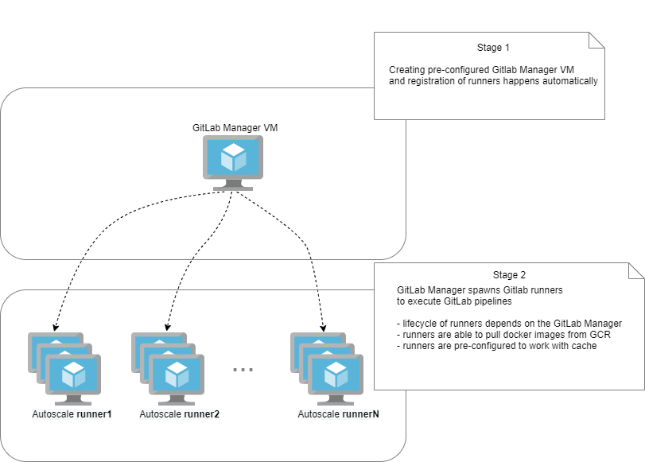

# Autoscale GitLab Runner on Google VM module

The purpose of this module is to create "GitLab Manager" VM, configure it and register "GitLab runner(s)" which allows automatically spin up and down VMs to make sure your builds get processed immediately.



## Features
- Use preemptible or regular on-demand VMs
- There is ability to configure from **1** to **N** amounts of runners inside `gitlab_register_runner` variable each with its own attributes
- Supports docker images for CI/CD jobs stored in private GCR rregistry. Such code in `.gitlab-ci.yml` is available:
```
test:
  stage: mystage
  image: us.gcr.io/<project_id>/<path_to_gcr>/<image_name>:<number>
  script:
  ...
```
- Forked version of [docker+machine](https://docs.gitlab.com/runner/executors/docker_machine.html#forked-version-of-docker-machine) executor
- [Distributed runners caching](https://docs.gitlab.com/runner/configuration/autoscale.html#distributed-runners-caching) is enabled from the box

## Requirements
Runners can be configured as shared|group|specific. Based on the above the appropriate registration token should be taken. For more info please refer [here](https://docs.gitlab.com/ee/ci/runners/README.html)

Example of module usage:
```
module "gitlab-runner" {
  source   = "allyrr/gitlab-runner/google"

  gcp_gitlab_resource_prefix = "gitlab"
  gcp_project_id = "YOUR_PROJECT"
  gitlab_registration_token = "YOUR_TOKEN"
  gcp_region = "us-central1"
  gcp_zone = "us-central1-a"

  gitlab_register_runner = {
    "runner1" = {
      "runner_limit"=10
      "runner_request_concurrency"=1
      "runner_url"="https://gitlab.com/"
      "runner_idle_nodes"=0
      "runner_idle_time"=300
      "runner_max_builds"=10
      "runner_machine_type"="n2-standard-2"
      "runner_preemptible"=true
      "runner_disk_size"=50
      "runner_description"="gitlab-runner1"
      "runner_tag"="gcp-n2-standard-8gb"
    }
    "runner2" = {
      "runner_limit"=3
      "runner_request_concurrency"=1
      "runner_url"="https://gitlab.com/"
      "runner_idle_nodes"=1
      "runner_idle_time"=0
      "runner_max_builds"=10
      "runner_machine_type"="n2-standard-2"
      "runner_preemptible"=false
      "runner_disk_size"=50
      "runner_description"="gitlab-runner2"
      "runner_tag"="gcp-n2-standard-8gb"
    }
  }
}
output "gitlab-manager" {
  value = module.gcp_gitlab_runner.gitlab-manager
}

```
## Providers

| Name | Version |
|------|---------|
| <a name="provider_google"></a> [google](#provider\_google) | n/a |
| <a name="provider_google-beta"></a> [google-beta](#provider\_google-beta) | n/a |
| <a name="provider_random"></a> [random](#provider\_random) | n/a |
| <a name="provider_template"></a> [template](#provider\_template) | n/a |

## Inputs

| Name | Description | Type | Default | Required |
|------|-------------|------|---------|:--------:|
| <a name="input_gcp_gcs_cache_age"></a> [gcp\_gcs\_cache\_age](#input\_gcp\_gcs\_cache\_age) | Time in days to keep the GitLab's cache in the GCS bucket | `number` | `60` | no |
| <a name="input_gcp_gitlab_resource_prefix"></a> [gcp\_gitlab\_resource\_prefix](#input\_gcp\_gitlab\_resource\_prefix) | Name prefix for all the resources | `string` | `"gitlab"` | no |
| <a name="input_gcp_main_vpc_sub_ip_range"></a> [gcp\_main\_vpc\_sub\_ip\_range](#input\_gcp\_main\_vpc\_sub\_ip\_range) | GCP default subnetwork ip range | `string` | `"10.10.0.0/20"` | no |
| <a name="input_gcp_project_id"></a> [gcp\_project\_id](#input\_gcp\_project\_id) | GCP project id | `string` | n/a | yes |
| <a name="input_gcp_region"></a> [gcp\_region](#input\_gcp\_region) | GCP default region | `string` | n/a | yes |
| <a name="input_gcp_zone"></a> [gcp\_zone](#input\_gcp\_zone) | GCP default zone | `string` | n/a | yes |
| <a name="input_gitlab_docker_machine_release"></a> [gitlab\_docker\_machine\_release](#input\_gitlab\_docker\_machine\_release) | Release version of forked docker-machine. Available releases: https://gitlab.com/gitlab-org/ci-cd/docker-machine/-/releases | `string` | `"v0.16.2-gitlab.11"` | no |
| <a name="input_gitlab_register_runner"></a> [gitlab\_register\_runner](#input\_gitlab\_register\_runner) | Map of different GitLab runners and their attributes. For more info refer 1) Google Machine drivers - https://docs.docker.com/machine/drivers/gce/ and 2) GitLab One-line registration command https://docs.gitlab.com/runner/register/#one-line-registration-command | `any` | `{}` | no |
| <a name="input_gitlab_registration_token"></a> [gitlab\_registration\_token](#input\_gitlab\_registration\_token) | Registration token. Can be found under Settings > CI/CD and expand the Runners section of group you want to make the runner work for | `string` | n/a | yes |

## Outputs

| Name | Description |
|------|-------------|
| <a name="output_gitlab-manager"></a> [gitlab-manager](#output\_gitlab-manager) | String to SSH into a GitLab manager VM |

## Sponsors

This work has been sponsored by [Scotts Miracle Gro](https://scottsmiraclegro.com/) and [LITSLINK](https://litslink.com/).

[](http://digitalasset.com)
[](https://litslink.com/)
